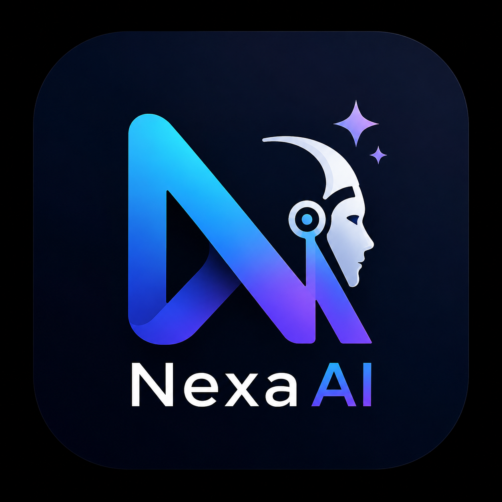

<div align="center">

  

  # 🤖 NexaAI — Intelligent Conversational AI Platform

  **A modern, full-stack AI chat application built with React, Node.js, Express, MongoDB, and the Groq LLM API.**

  [](https://nexaai-your-intelligent-ai-assistant.onrender.com)
  [](https://reactjs.org/)
  [](https://nodejs.org/)
  [](https://expressjs.com/)
  [](https://www.mongodb.com/)
  [](https://tailwindcss.com/)
  [](https://groq.com/)

  ### 🔗 **[Live Demo: nexaai-your-intelligent-ai-assistant.onrender.com](https://nexaai-your-intelligent-ai-assistant.onrender.com)**

  [Features](#-key-features) • [Tech Stack](#-tech-stack) • [Quick Start](#-quick-start) • [Environment Variables](#-environment-variables) • [Deployment](#-deployment-guide-render) • [License](#-author--credits)

</div>

---

## 🌟 Key Features

- ⚡ **Ultra-Fast AI Responses**: Powered by **Groq Cloud API** running `llama-3.3-70b-versatile` for blazing-fast inference speeds.
- 📱 **ChatGPT-Style Mobile Responsive Design**: Seamless experience across Desktop, Tablet, and Mobile devices with a collapsible slide-out drawer sidebar, backdrop overlay, and quick new chat actions.
- 🌙 **Light & Dark Mode**: Interactive segmented theme switcher in Settings, persisted in `localStorage` with system-wide CSS variable tokens.
- 🔐 **Full-Stack Authentication & Security**:
  - Encrypted password hashing with `bcryptjs`.
  - Secure session management with **JSON Web Tokens (JWT)**.
  - Interactive Tailwind UI sign-in and sign-up modals inside the profile settings dropdown.
- 🔒 **100% User Data Isolation**:
  - Every user's chat history is privately stored under their unique `userId` in MongoDB.
  - Isolated browser sessions for guests (`guestId`) so visitors never see each other's or developer test threads.
- 📝 **Rich Markdown & Code Rendering**:
  - Formatted tables with horizontal scroll.
  - Syntax-highlighted code blocks with 1-click **Copy Code** button.
  - Blockquotes, bold text, lists, and inline code formatting.
- 💬 **Conversation Management**: Create new chats, switch between past threads, delete conversations, and auto-scroll with typing bounce indicators.

---

## 🛠️ Tech Stack

### Frontend
- **Framework**: [React 19](https://react.dev/) + [Vite](https://vitejs.dev/)
- **Styling**: [Tailwind CSS v4](https://tailwindcss.com/) + Pure CSS Design Tokens
- **Icons**: [FontAwesome 6](https://fontawesome.com/)
- **Markdown**: `react-markdown`, `remark-gfm`
- **Unique IDs**: `uuid`

### Backend
- **Runtime**: [Node.js](https://nodejs.org/) (ES Modules)
- **Framework**: [Express 5](https://expressjs.com/)
- **Database**: [MongoDB Atlas](https://www.mongodb.com/) via [Mongoose](https://mongoosejs.com/)
- **Authentication**: `jsonwebtoken` (JWT) + `bcryptjs`
- **AI Integration**: Official `@groq/groq-sdk`
- **CORS & Environment**: `cors`, `dotenv`

---

## 📁 Project Architecture

```plaintext
NexaAI/
├── Backend/
│   ├── middleware/
│   │   └── auth.js         # JWT verification & guest session middleware
│   ├── models/
│   │   ├── Thread.js       # Conversation thread schema (userId, guestId, messages)
│   │   └── User.js         # User authentication schema (name, email, password)
│   ├── routes/
│   │   ├── auth.js         # /api/auth/signup, /api/auth/login, /api/auth/me
│   │   └── chat.js         # /api/chat, /api/thread, /api/thread/:threadId
│   ├── utils/
│   │   └── Groq.js         # Groq AI model connection utility
│   ├── server.js           # Express app entry point & MongoDB connection
│   └── package.json
│
├── Frontend/
│   ├── public/
│   │   └── NexaAI1.png     # Application logo & favicon
│   ├── src/
│   │   ├── App.jsx         # Root component with Theme & Auth state
│   │   ├── Auth.jsx        # Tailwind UI Sign-in & Sign-up modal
│   │   ├── Chat.jsx        # Message list & Markdown/Code renderer
│   │   ├── ChatWindow.jsx  # Main chat window, navbar, & input controls
│   │   ├── SettingsModal.jsx # Settings modal (Theme toggle & Account management)
│   │   ├── Sidebar.jsx     # Slide-out history sidebar & New chat actions
│   │   ├── config.js       # API Base URL & Dynamic Auth Headers
│   │   ├── MyContext.jsx   # Global React Context
│   │   └── index.css       # Design tokens for Light & Dark themes
│   └── package.json
│
└── README.md
```

---

## 🚀 Quick Start

### 1. Clone the Repository
```bash
git clone https://github.com/DurgeshNandan1105/NexaAI.git
cd NexaAI
```

### 2. Backend Setup
1. Navigate to the `Backend` directory:
   ```bash
   cd Backend
   npm install
   ```
2. Create a `.env` file in `Backend/` with your credentials:
   ```env
   PORT=8000
   GROQ_API_KEY=your_groq_api_key_here
   MONGODB_URI=your_mongodb_connection_string
   JWT_SECRET=your_super_secret_jwt_key_2026
   ```
3. Start the backend development server:
   ```bash
   npm start
   ```
   *(Server will run on `http://localhost:8000`)*

---

### 3. Frontend Setup
1. Open a new terminal and navigate to `Frontend`:
   ```bash
   cd Frontend
   npm install
   ```
2. Start the Vite dev server:
   ```bash
   npm run dev
   ```
3. Open **`http://localhost:5173`** in your browser.

---

## ⚙️ Environment Variables

### Backend (`Backend/.env`)
| Variable | Description | Example |
| :--- | :--- | :--- |
| `PORT` | Port for Express server | `8000` |
| `GROQ_API_KEY` | Groq Cloud API Key | `gsk_...` |
| `MONGODB_URI` | MongoDB Atlas connection string | `mongodb+srv://...` |
| `JWT_SECRET` | Secret key for signing JWT tokens | `nexa_ai_secret_jwt_2026` |

### Frontend (`Frontend/.env` - Optional for production)
| Variable | Description | Default |
| :--- | :--- | :--- |
| `VITE_API_BASE_URL` | Backend API URL | `http://localhost:8000` |

---

## 🌐 Deployment Guide (Render)

### Step 1: Deploy Backend (Web Service)
1. Go to [Render Dashboard](https://dashboard.render.com/) $\rightarrow$ **New +** $\rightarrow$ **Web Service**.
2. Connect your GitHub repository.
3. Configure settings:
   - **Root Directory**: `Backend`
   - **Runtime**: `Node`
   - **Build Command**: `npm install`
   - **Start Command**: `node server.js`
4. Add Environment Variables: `GROQ_API_KEY`, `MONGODB_URI`, `JWT_SECRET`.
5. Click **Create Web Service** and copy your backend URL (e.g. `https://nexaai-backend.onrender.com`).

### Step 2: Deploy Frontend (Static Site)
1. In Render Dashboard $\rightarrow$ **New +** $\rightarrow$ **Static Site**.
2. Connect the same repository.
3. Configure settings:
   - **Root Directory**: `Frontend`
   - **Build Command**: `npm install && npm run build`
   - **Publish Directory**: `dist`
4. Add Environment Variable:
   - `VITE_API_BASE_URL` = `https://nexaai-backend.onrender.com`
5. Click **Create Static Site**.

---

## 👨‍💻 Author & Credits

- **Developer**: [Durgesh Nandan](https://github.com/DurgeshNandan1105)
- **Design Inspiration**: OpenAI ChatGPT & Tailwind UI

---

<div align="center">
  <sub>Built with ❤️ by Durgesh Nandan</sub>
</div>
